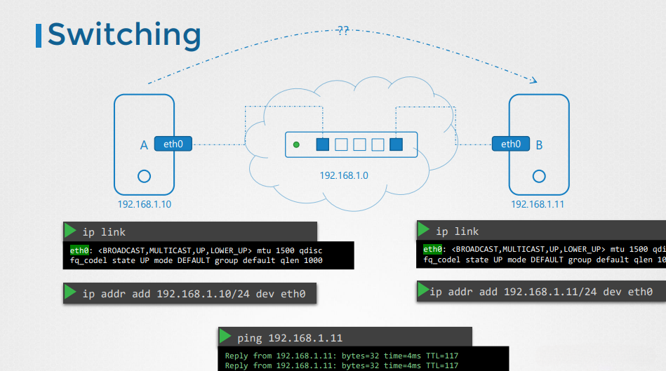
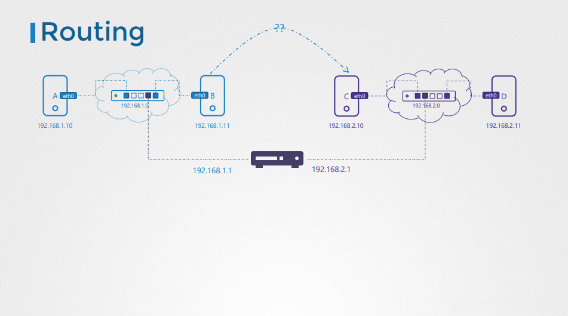
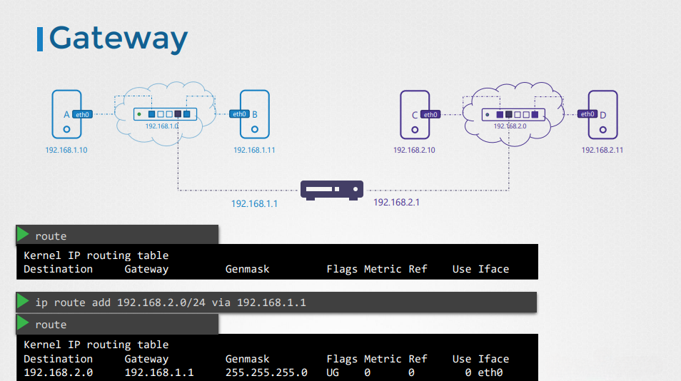

# Networking Basics in Linux

## Overview
Networking is a fundamental aspect of system administration and application development. Understanding how networking works in Linux helps in configuring systems, troubleshooting issues, and securing network communication.

---

## Core Networking Concepts

1. **Switching** - Connects devices within the same network and forwards data based on MAC addresses.
2. **Routing** - Determines the path that data packets take from source to destination.
3. **Gateways** - Acts as a bridge between different networks.
4. **DNS (Domain Name System)** - Translates domain names to IP addresses for easy access to resources.

---

## Switching
Switching allows communication between devices on the same network without involving a router. The following diagram illustrates how two devices (A and B) communicate over the same subnet through a switch:



### Configuring a Network Interface for Switching
To bring up the interface and assign an IP address:

```bash
ip link set eth0 up
ip addr add 192.168.1.10/24 dev eth0  # For machine A
ip addr add 192.168.1.11/24 dev eth0  # For machine B
```

To verify connectivity, use `ping`:

```bash
ping 192.168.1.11  # From machine A to B
```

If the switch is functioning correctly, machine A should receive replies from B, indicating successful local network communication.

---

## Routing
Routing determines how packets move from one network to another. Unlike switching, routing is used when devices need to communicate across different subnets.

The diagram below shows a network scenario where devices in `192.168.1.0/24` need to communicate with devices in `192.168.2.0/24` through a router.



### Viewing and Configuring Routes
To display the current routing table:

```bash
ip route show
```

To add a route so that packets for `192.168.2.0/24` are sent via `192.168.1.1`:

```bash
ip route add 192.168.2.0/24 via 192.168.1.1
```

This configuration ensures that packets from `192.168.1.0/24` can reach the `192.168.2.0/24` network through the router at `192.168.1.1`.

---

## Gateways
A gateway connects different networks, acting as an entry and exit point for data transmission. In the following diagram, a gateway is used to bridge communication between networks `192.168.1.0/24` and `192.168.2.0/24`.



### Configuring a Gateway
To set up a gateway for traffic forwarding, enable IP forwarding on the Linux router:

```bash
echo 1 > /proc/sys/net/ipv4/ip_forward
```

To make this setting persistent across reboots, edit `/etc/sysctl.conf` and add:

```bash
net.ipv4.ip_forward = 1
```

Then, apply the changes:

```bash
sysctl -p
```

With this configuration, the router will forward packets between the networks.

---

## Configuring DNS in Linux
DNS settings in Linux can be managed using the `/etc/resolv.conf` file or through network manager tools. To check the current DNS configuration:

```bash
cat /etc/resolv.conf
```

To manually set a DNS server, edit the file and add:

```bash
nameserver 8.8.8.8
nameserver 8.8.4.4
```

For systems using `systemd-resolved`, you can update DNS settings using:

```bash
systemctl restart systemd-resolved
```

---

## Conclusion
Understanding networking basics in Linux helps with configuring and troubleshooting systems efficiently. These foundational concepts will be essential for managing networks, setting up services, and ensuring secure communication across systems.

