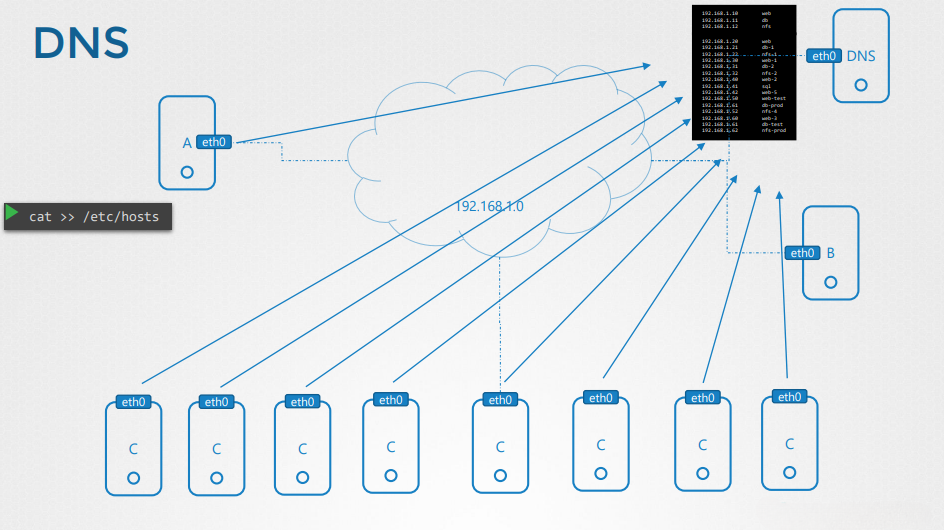
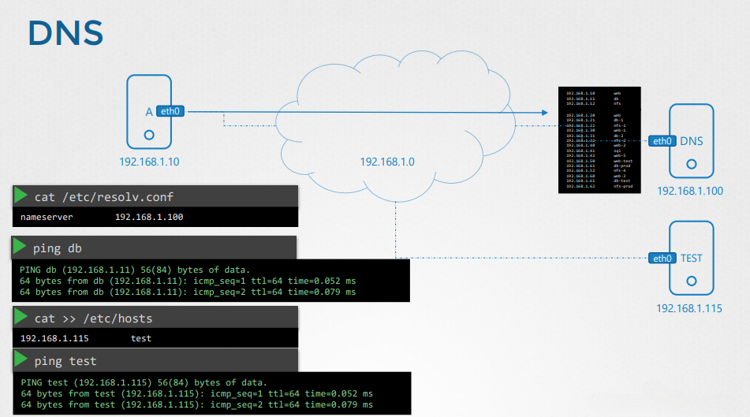
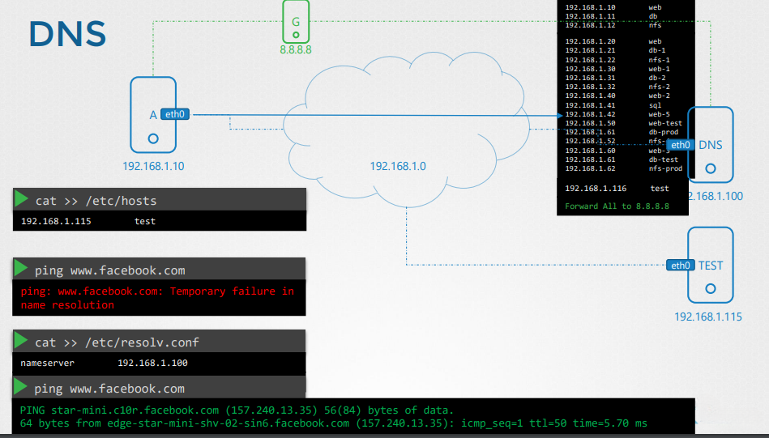

# DNS Configuration in Linux

## Overview

The Domain Name System (DNS) is a critical component of networking that translates human-readable domain names into IP addresses. In Linux, DNS configuration can be managed through various files and tools.

---

## Configuring Hostnames with `/etc/hosts`

The `/etc/hosts` file is a local method for mapping hostnames to IP addresses. This is useful for local name resolution without relying on an external DNS server.



The image above illustrates a DNS setup where multiple machines rely on local hostname resolution using the `/etc/hosts` file. This ensures hostname-to-IP mapping within a local network without querying an external DNS server.

To add a hostname entry, open the file using a text editor:

```bash
sudo nano /etc/hosts
```

Add an entry in the following format:

```bash
192.168.1.10    webserver.local
```

Save and exit the file. Now, you can ping the hostname instead of the IP address:

```bash
ping webserver.local
```

---

## Configuring DNS Resolution with `/etc/resolv.conf`

The `/etc/resolv.conf` file defines the system’s DNS servers. To manually configure DNS, edit the file:



The image above depicts a system where DNS resolution is managed by specifying nameservers in the `/etc/resolv.conf` file. This configuration allows the system to query external DNS servers for domain resolution.

```bash
sudo nano /etc/resolv.conf
```

Add nameserver entries:

```bash
nameserver 8.8.8.8
nameserver 8.8.4.4
```

Save and exit the file. Restart the network service if necessary:

```bash
sudo systemctl restart networking
```

For systems using `systemd-resolved`, update DNS settings:

```bash
systemctl restart systemd-resolved
```

---

## Checking DNS Resolution

To test DNS name resolution, use the `nslookup` or `dig` command:



This image represents the process of testing DNS resolution. The system queries a DNS server to resolve domain names into IP addresses, confirming proper DNS configuration and connectivity.

```bash
nslookup google.com
```

or

```bash
dig google.com
```

These commands query the configured DNS servers and return the resolved IP address.

---

## Modifying Name Resolution Order with `/etc/nsswitch.conf`

The `/etc/nsswitch.conf` file determines the order in which name resolution methods are used. To prioritize local files over DNS, ensure the following line is present:

```bash
hosts: files dns
```

This configuration checks the `/etc/hosts` file before querying a DNS server.

---

## DNS Record Types

- **A Record:** Maps a hostname to an IPv4 address.
- **AAAA Record:** Maps a hostname to an IPv6 address.
- **CNAME Record:** Creates an alias for a hostname.
- **MX Record:** Specifies mail servers for a domain.

---

## Conclusion

DNS plays a crucial role in network configuration and troubleshooting. Understanding how to manage `/etc/hosts`, `/etc/resolv.conf`, and `/etc/nsswitch.conf` allows for efficient hostname resolution in Linux environments. Proper DNS configuration ensures reliable and fast name resolution for applications and services.

