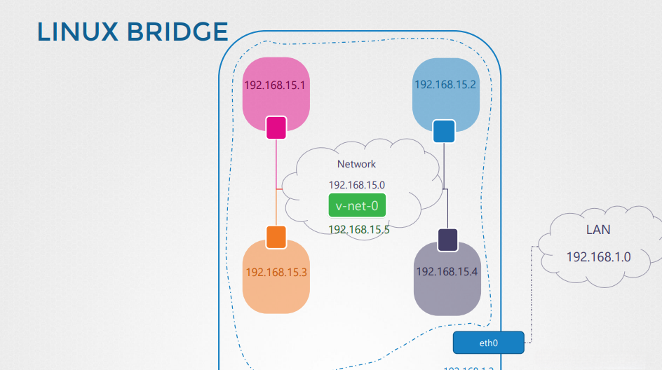
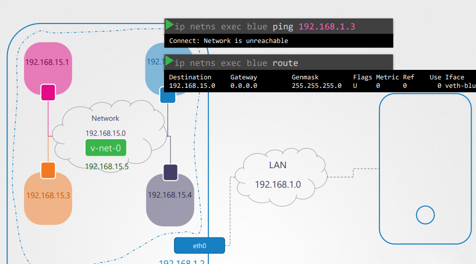
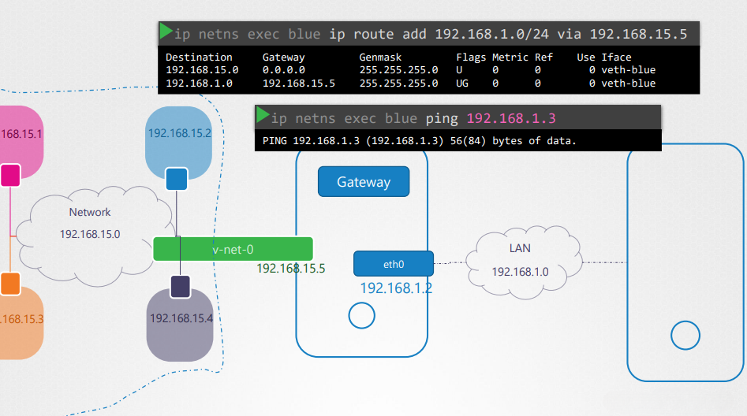

# Network Namespaces in Linux

## Introduction
Network namespaces provide a way to isolate network environments within a single Linux system. This allows containers and virtualized applications to have independent network stacks while sharing the same underlying host system.

---

## Understanding Network Namespaces

Network namespaces create isolated network environments similar to how namespaces work in process isolation. Each namespace has its own:
- Network interfaces
- Routing tables
- ARP tables

When a network namespace is created, it starts with no network interfaces apart from a default loopback interface.



The image above illustrates a Linux bridge setup that connects multiple network namespaces. The bridge (`v-net-0`) allows isolated networks (`192.168.15.x`) to communicate while remaining segregated from the main LAN (`192.168.1.0`).

---

## Creating and Managing Network Namespaces

### Creating a Network Namespace
To create a new network namespace, use the following command:
```bash
ip netns add red
ip netns add blue
```
This creates two isolated network namespaces: `red` and `blue`.

### Listing Network Namespaces
```bash
ip netns list
```
This displays all existing network namespaces.

### Assigning Interfaces to Namespaces
To move a network interface into a namespace:
```bash
ip link set eth0 netns red
```
This assigns the `eth0` interface to the `red` namespace.

### Verifying Interfaces
To check interfaces within a namespace:
```bash
ip netns exec red ip link
```

---

## Connecting Network Namespaces
By default, network namespaces are isolated and cannot communicate. To enable communication, a virtual Ethernet (veth) pair is used.

### Creating a Virtual Ethernet Pair
```bash
ip link add veth-red type veth peer name veth-blue
```
This creates two virtual interfaces, `veth-red` and `veth-blue`, that act as a communication link.

### Assigning veth Interfaces to Namespaces
```bash
ip link set veth-red netns red
ip link set veth-blue netns blue
```
Now each namespace has one end of the veth pair.

### Assigning IP Addresses
```bash
ip netns exec red ip addr add 192.168.15.1/24 dev veth-red
ip netns exec blue ip addr add 192.168.15.2/24 dev veth-blue
```
This assigns IP addresses for communication.

### Enabling Interfaces
```bash
ip netns exec red ip link set veth-red up
ip netns exec blue ip link set veth-blue up
```
Now the interfaces are active.



The image above demonstrates a failed ping attempt due to missing routing rules. The `blue` namespace cannot communicate with external networks as its routing table only allows communication within its subnet.

### Testing Connectivity
```bash
ip netns exec red ping -c 3 192.168.15.2
```
If successful, the namespaces can communicate.

---

## Using a Bridge for Multiple Namespaces
Instead of using direct veth pairs, a Linux bridge can be used to connect multiple namespaces.

### Creating a Bridge
```bash
ip link add name br0 type bridge
ip link set br0 up
```

### Connecting veth Pairs to the Bridge
```bash
ip link set veth-red master br0
ip link set veth-blue master br0
```
Now both namespaces are part of the same bridge network.



This image shows a corrected routing table where the `blue` namespace can now reach the external network via the gateway `192.168.15.5`. The `ping` test is successful, confirming connectivity.

---

## Configuring External Access
By default, namespaces cannot access the outside network. To enable connectivity:

### Setting Up NAT
```bash
iptables -t nat -A POSTROUTING -s 192.168.15.0/24 -o eth0 -j MASQUERADE
```
This allows traffic from the namespaces to be translated for external communication.

### Adding a Default Route
```bash
ip netns exec red ip route add default via 192.168.15.1
```
This sets up a gateway for internet access.

---

## Conclusion
Network namespaces are a powerful tool for isolating and managing network configurations within Linux. They allow for flexible network setups, essential for containerization and advanced networking scenarios.
