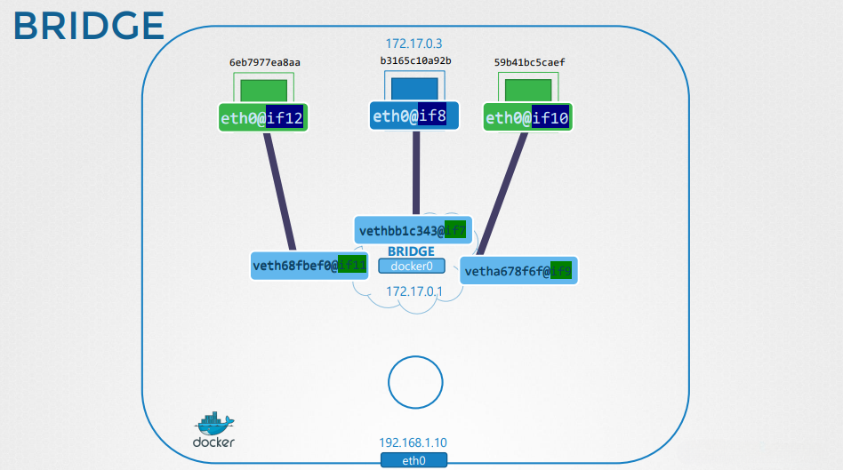
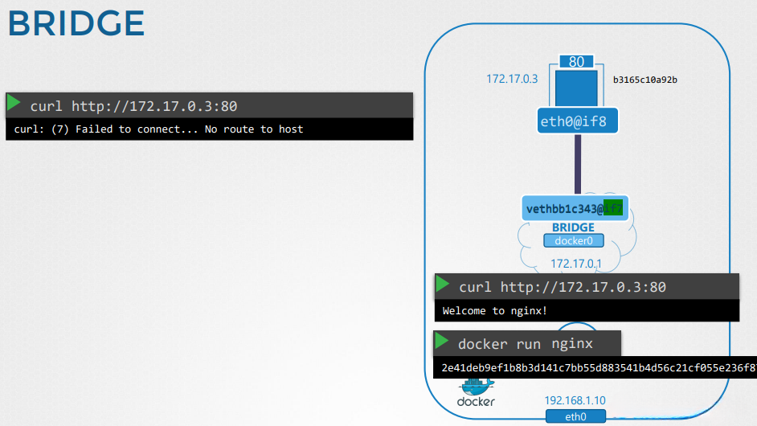

# Docker Networking Basics

## Overview
Docker provides multiple networking options to enable communication between containers and external systems. Understanding these options is essential for deploying and managing containerized applications efficiently.

---

## Docker Networking Options

### 1. **None Network**
- Containers are not attached to any network.
- Cannot reach the external world or other containers.
- Best used for isolated workloads.


The image above illustrates a container running in the `none` network mode, where it is completely isolated from any external or internal networks.

### 2. **Host Network**
- The container shares the network namespace with the host.
- No network isolation between the host and the container.
- Suitable for applications needing high performance without NAT.


The image above shows a container running in the `host` network mode, where it directly binds to the host's network interfaces.

### 3. **Bridge Network (Default)**
- An internal private network allowing communication between containers.
- Uses NAT for external connectivity.
- Containers get unique private IPs (e.g., `172.17.0.0/16`).
- Default network mode for Docker.


This image demonstrates a basic bridge network configuration, where containers communicate internally but require port mapping to be accessed externally.

---

## Creating and Managing Docker Networks

### Viewing Existing Networks
```bash
docker network ls
```

### Inspecting Network Details
```bash
docker network inspect bridge
```

### Creating a Custom Bridge Network
```bash
docker network create --driver bridge my_custom_network
```

### Connecting a Container to a Network
```bash
docker run -d --name my_container --network my_custom_network nginx
```

### Attaching an Existing Container to a Network
```bash
docker network connect my_custom_network my_container
```

### Disconnecting a Container from a Network
```bash
docker network disconnect my_custom_network my_container
```

### Removing a Network
```bash
docker network rm my_custom_network
```

---

## Port Mapping and NAT
Since bridge networks use NAT, external access requires explicit port mapping.



This image shows the concept of NAT with Docker bridge networking, where a container’s internal port is mapped to an external port for accessibility.

### Publishing Ports
```bash
docker run -d -p 8080:80 nginx
```
- Maps port `80` in the container to port `8080` on the host.
- External users can access the application using `http://host_ip:8080`.

### Viewing NAT Rules
```bash
iptables -t nat -L -n -v
```

---

## NAT and PREROUTING in Docker
Docker uses iptables rules for forwarding and NAT translation.



The image above highlights how Docker handles packet forwarding and NAT rules using `iptables`.

### Adding a PREROUTING Rule Manually
```bash
iptables -t nat -A PREROUTING -p tcp --dport 8080 -j REDIRECT --to-port 80
```
- Redirects incoming traffic on port `8080` to port `80` inside the container.

### Listing iptables Rules
```bash
iptables -t nat -L
```

---

## Conclusion
Understanding Docker networking options is crucial for deploying containerized applications. By leveraging bridge networks, host networking, and NAT rules, developers can ensure efficient communication between containers and external services.
