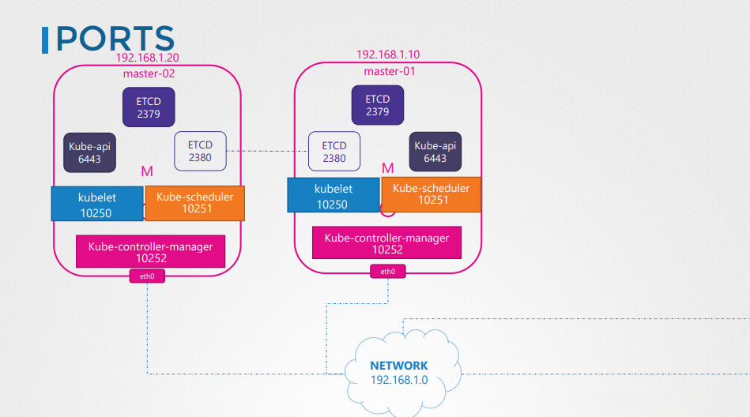
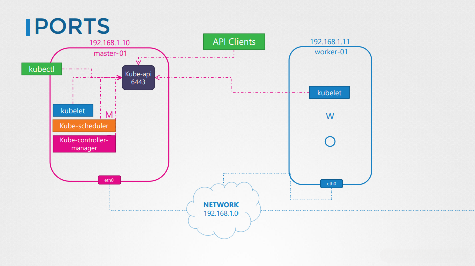
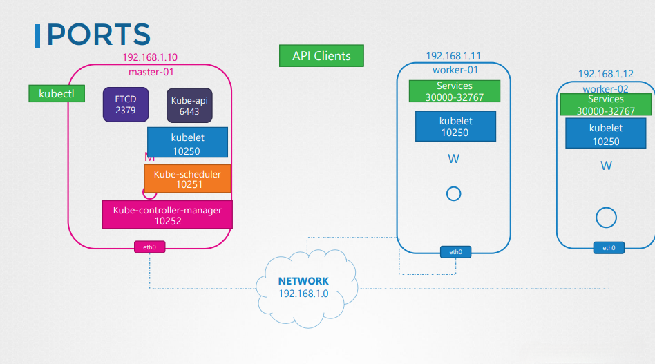
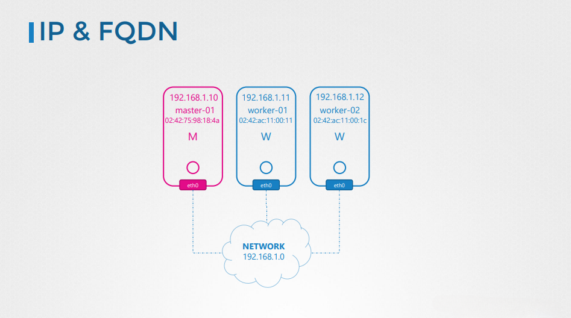

# Kubernetes Networking Configuration

## Overview
This section explores the networking configurations required for master and worker nodes in a Kubernetes cluster. Proper networking setup ensures seamless communication between nodes, control plane components, and external clients.

---

## Kubernetes Cluster Networking
A Kubernetes cluster consists of:
- **Master Nodes**: Manage the cluster and run control plane components.
- **Worker Nodes**: Run containerized workloads and communicate with the master node.

Each node must have at least one network interface configured with a unique hostname, MAC address, and IP address.



The image above illustrates the essential networking setup for Kubernetes master nodes, including communication between etcd, the kube-api server, and other control plane components.

---

## Essential Ports for Kubernetes Networking

Certain ports must be open for proper cluster communication:

### **Master Node Ports**
- **6443**: Kubernetes API server (accessible by kubectl, worker nodes, and external clients)
- **10250**: Kubelet (for running and managing containers on nodes)
- **10251**: Kube-scheduler
- **10252**: Kube-controller-manager

### **Worker Node Ports**
- **10250**: Kubelet (to communicate with the master node)
- **30000-32767**: NodePort services for external access

### **ETCD Ports (for High-Availability Master Nodes)**
- **2379-2380**: Communication between etcd members



This image demonstrates how worker nodes communicate with the master node and how services are exposed via NodePort ranges.

---

## Setting Up Network Security
When configuring Kubernetes networking, consider:
- **Firewall Rules**: Ensure necessary ports are open.
- **Security Groups (Cloud Environments like AWS, Azure, GCP)**: Adjust ingress and egress rules.
- **IP Tables**: Validate NAT and routing rules for pod communication.



The above image depicts how API clients interact with the Kubernetes API server, allowing management commands to be executed across the cluster.

---

## Practical Exercises
To understand networking in Kubernetes, explore:
1. Listing network interfaces on nodes:
   ```bash
   ip addr show
   ```
2. Checking firewall rules:
   ```bash
   sudo iptables -L -v -n
   ```
3. Viewing active ports:
   ```bash
   netstat -tulnp | grep kube
   ```



This image highlights the assignment of IP addresses and fully qualified domain names (FQDNs) to nodes within a Kubernetes cluster.

---

## Conclusion
Understanding Kubernetes networking ensures smooth cluster operation, optimal connectivity, and proper communication between components. Configuring firewall rules, security groups, and verifying open ports help maintain a secure and efficient Kubernetes deployment.
