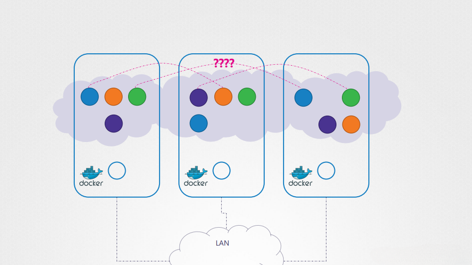
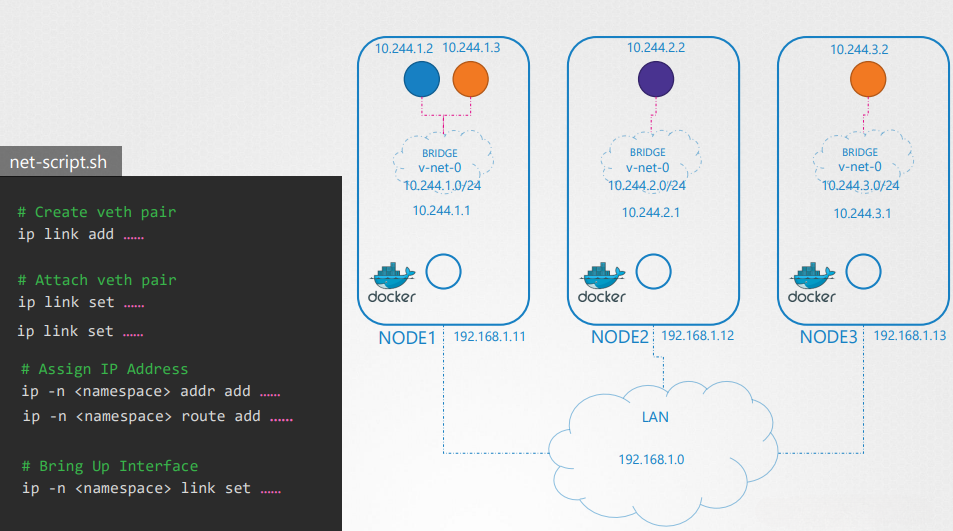
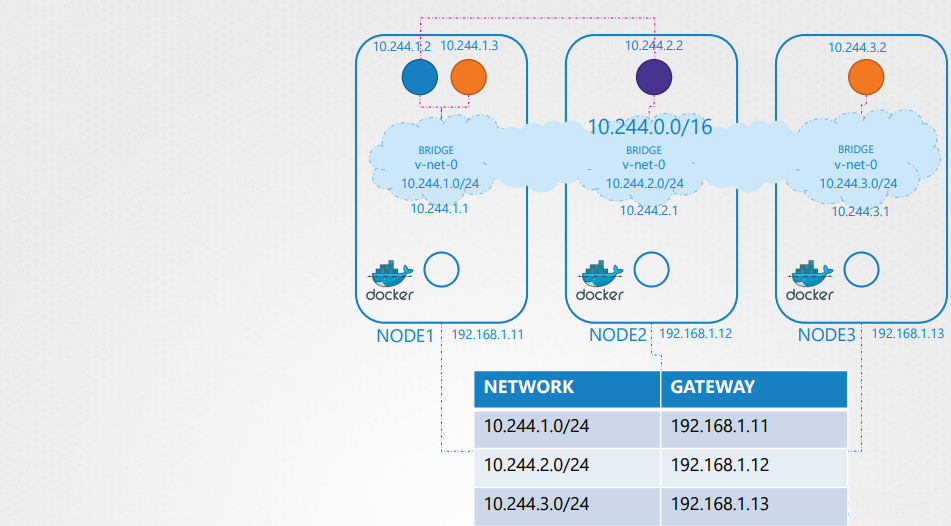
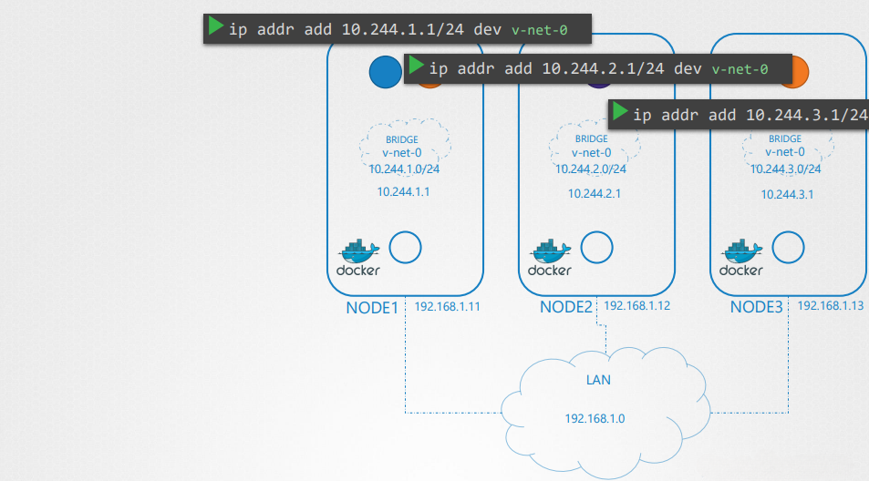
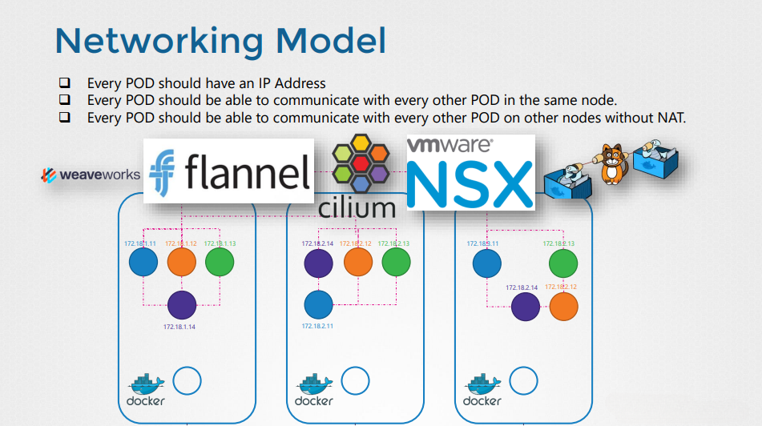

# Kubernetes Pod Networking

## Overview
Kubernetes pod networking is an essential component of container orchestration, enabling communication between pods within a cluster and with external services. Understanding how pod networking works is crucial for deploying scalable and efficient applications in Kubernetes.

## Network Configuration in Kubernetes
A Kubernetes cluster consists of multiple nodes, categorized into master and worker nodes. Each node must have at least one network interface, a unique hostname, and a MAC address to facilitate networking.

- **Master Nodes**: Control plane components communicate over a network and manage cluster state.
- **Worker Nodes**: Run application workloads and interact with the control plane.

Proper configuration of firewalls and network security groups is necessary to allow communication between the control plane components.



The image above illustrates how Kubernetes assigns subnets to each node, enabling pod communication across multiple nodes.

---

## Pod Networking Model
Networking at the pod level differs from traditional host-based networking. Kubernetes follows a flat network model where each pod gets a unique IP address, allowing direct communication between pods without the need for NAT.

### Kubernetes Pod Networking Requirements
Kubernetes networking requires:
1. Each pod to receive a unique IP address.
2. Pods within a node to communicate with each other using their assigned IPs.
3. Pods on different nodes to communicate without requiring additional NAT configurations.
4. Seamless integration of networking solutions, ensuring compatibility across various cluster setups.



This image demonstrates an automated script (`net-script.sh`) for setting up veth pairs, assigning IP addresses, and configuring routes for pod communication.

---

## Implementing Pod Networking
Kubernetes does not come with a built-in networking solution; instead, it relies on networking plugins based on the Container Network Interface (CNI) specification.

### Network Namespace Creation
Each pod in Kubernetes is assigned its own network namespace, which isolates its network stack from other pods. This isolation ensures that:
- Pods cannot interfere with each other’s network settings.
- Each pod maintains its own virtual network interfaces.

### Configuring Network Communication
A common approach to establishing pod networking is through **bridge networks**. The steps include:
1. Creating a **bridge network** on each node.
2. Assigning a unique subnet to each bridge network (e.g., `10.244.1.0/24`, `10.244.2.0/24`, etc.).
3. Attaching pod network namespaces to the bridge using **virtual Ethernet interfaces (veth pairs)**.
4. Setting up **routes** for inter-node communication.



The image above depicts how bridge networks facilitate pod networking by connecting different nodes through virtual Ethernet interfaces.

#### Example Network Bridge Configuration
```sh
ip link add name cni0 type bridge
ip addr add 10.244.1.1/24 dev cni0
ip link set cni0 up
```

---

## Inter-Node Communication
Pods in different nodes communicate using a combination of:
- **Routing tables**: Define how packets should be forwarded between nodes.
- **Overlay networks**: Encapsulate traffic within tunnels (e.g., Flannel, Calico).
- **Direct routing**: Uses BGP or IP-in-IP to enable cross-node pod communication.

To facilitate inter-node communication, nodes maintain routing information that directs traffic to the appropriate pod network.

Example:
```sh
ip route add 10.244.2.0/24 via 192.168.1.12
```



This image showcases the routing configuration necessary for inter-node pod communication within a Kubernetes cluster.

---

## Automating Pod Network Configuration
Manually configuring networking components is impractical for large clusters. Instead, Kubernetes relies on **CNI plugins** to automate this process. CNI plugins handle:
- IP address assignment.
- Network namespace creation.
- Setting up virtual Ethernet pairs.
- Configuring routes for pod communication.

Example CNI configuration snippet:
```json
{
  "cniVersion": "0.3.1",
  "name": "pod-network",
  "type": "bridge",
  "bridge": "cni0",
  "isGateway": true,
  "ipMasq": true,
  "ipam": {
    "type": "host-local",
    "subnet": "10.244.0.0/16",
    "routes": [{ "dst": "0.0.0.0/0" }]
  }
}
```



The image above highlights different CNI solutions, including **Flannel, Calico, Cilium, and NSX**, which enable seamless pod communication across nodes.

---

## Conclusion
Kubernetes pod networking ensures seamless communication across the cluster, with each pod having a unique IP address. By leveraging CNI plugins and efficient routing mechanisms, Kubernetes enables scalable, flexible, and secure networking for containerized applications. Understanding these networking fundamentals is critical for deploying and managing production-grade Kubernetes clusters.
